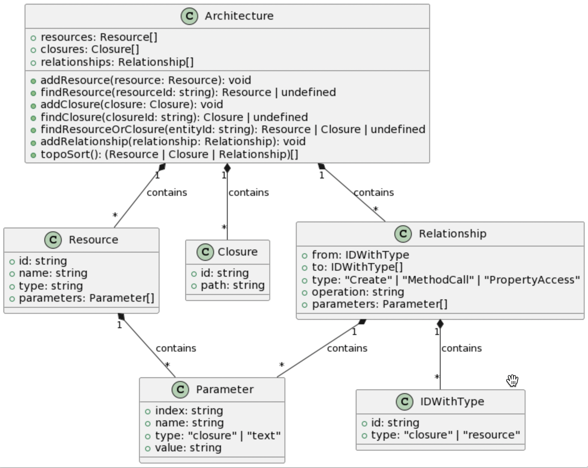

# 参考架构

参考架构（Architecture Reference，下称 Arch Ref）是[推导器](./deducer.zh-CN.md)的产出，体现了应用程序映射到云上的架构，包括应用需要创建的云 BaaS 资源实例、资源实例的事件处理函数，以及资源实例之间的关系。

用户可以从 Arch Ref 中了解应用程序的架构，并确认架构是否符合预期。Pluto 会根据 Arch Ref 的内容，自动创建云上 BaaS、FaaS 资源实例，并最小化权限配置。

## 构成

Arch Ref 包含资源实例、计算闭包、资源关系三个部分，下图为 Arch Ref 的构成：

### 资源实例

资源实例（Resource Instance）是应用程序需要创建的云资源实例，包括资源实例的 ID、类型、名称、参数等信息。

_目前，这里的名称与 ID 可能与运行时生成的 ID 不相符，因为，ID 同样根据资源名生成，在推导阶段，资源名称对应资源对象的变量名，而运行时资源对象的名字则根据用户给定的参数确定，参数与变量名可能不同，导致推导阶段的 ID 与运行时的 ID 不同。例如：`router = new Router("name")`，在生成的 Arch Ref 中，名称为 router，在运行时，资源名称将是 name。_

### 计算闭包

计算闭包（Compute Closure）通常是资源实例的事件处理函数，如 Queue 的订阅者、Router 的路径处理函数等，包括闭包的 ID、路径信息。

其中，路径信息为闭包导出后所处的文件夹路径，为相对于应用程序根目录的相对路径。如果是 TypeScript 应用程序，计算闭包文件夹是一个 Node.js 模块，包含一个 `index.ts` 文件，和使用 esbuild 编译打包生成的 `index.js`，在该模块中，导出的 `default` 函数即为用户定义的事件处理函数。

### 资源关系

资源关系（Relationship）表示资源实例之间的关系，包括关系的作用方、类型、操作、参数等信息。

作用方可能是资源实例或计算闭包。如果是资源实例，其对应的关系类型应该是 `Create`，对应操作应该属于该资源类型的 [Infra API](./sdk.zh-CN.md)，表示资源实例调用了某个 Infra API 创建了另一个资源实例或计算闭包。如果是计算闭包，其对应的关系类型应该是 `MethodCall` 或 `PropertyAccess`，表示在该计算闭包中调用了某个资源实例的 Client API 方法或属性。

`Create` 关系指导 Pluto 在编译时创建与关联资源实例，`MethodCall` 关系指导 Pluto 在编译时给计算闭包所属的 FaaS 实例配置合理的权限，`PropertyAccess` 关系指导 Pluto 在编译时给计算闭包所属的 FaaS 实例配置合理的环境变量，使其在运行时可以访问到资源实例的属性。

<!--
```plantuml
@startuml

class Architecture {
    +resources: Resource[]
    +closures: Closure[]
    +relationships: Relationship[]

    +addResource(resource: Resource): void
    +findResource(resourceId: string): Resource | undefined
    +addClosure(closure: Closure): void
    +findClosure(closureId: string): Closure | undefined
    +findResourceOrClosure(entityId: string): Resource | Closure | undefined
    +addRelationship(relationship: Relationship): void
    +topoSort(): (Resource | Closure | Relationship)[]
}

class Resource {
    +id: string
    +name: string
    +type: string
    +parameters: Parameter[]
}

class Closure {
    +id: string
    +path: string
}

class Relationship {
    +from: IDWithType
    +to: IDWithType[]
    +type: "Create" | "MethodCall" | "PropertyAccess"
    +operation: string
    +parameters: Parameter[]
}

class Parameter {
    +index: string
    +name: string
    +type: "closure" | "text"
    +value: string
}

class IDWithType {
    +id: string
    +type: "closure" | "resource"
}

' Relationships
Architecture "1" *-- "*" Resource : contains
Architecture "1" *-- "*" Closure : contains
Architecture "1" *-- "*" Relationship : contains

Resource "1" *-- "*" Parameter : contains
Relationship "1" *-- "*" Parameter : contains
Relationship "1" *-- "*" IDWithType : contains

@enduml
```
-->
