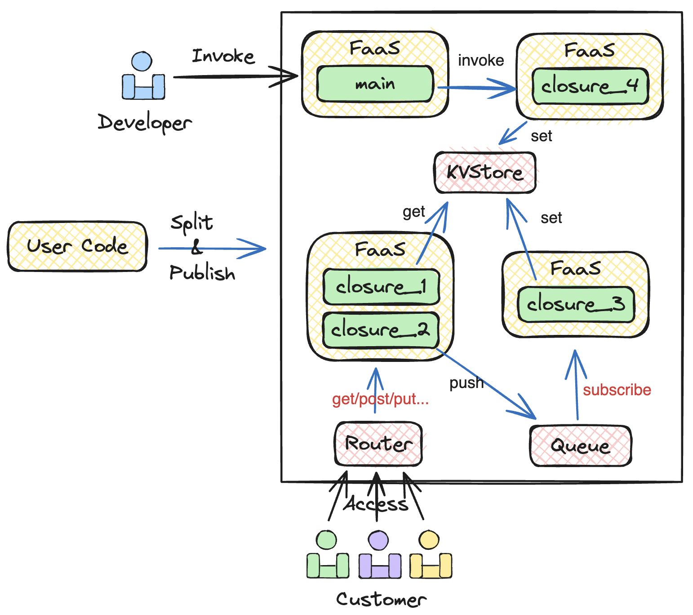
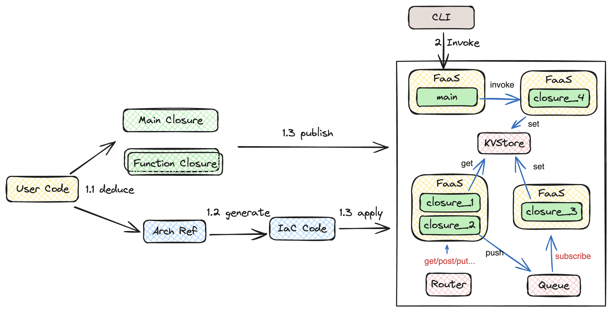

# 基于计算闭包的执行模式

Pluto 以计算闭包为粒度对程序代码进行拆分，每一个计算闭包都是一个独立的、可导入的计算模块。不同计算闭包可能存在共享的资源对象，如 Queue、KVStore 等，计算闭包对共享资源对象方法或属性的访问就成为了计算闭包间的连接，通过这些连接可以将所有计算闭包连接成图，即为应用程序的[参考架构](../concepts/arch-ref.zh-CN.md)。

在部署时，Pluto 会将计算闭包封装部署成 FaaS 资源实例，共享资源对象则被构建成 BaaS 资源实例，通过访问关系、事件触发关系（共享资源对象的访问与回调）可以将所有的 FaaS 与 BaaS 资源实例连接起来。这样就完成了参考架构到云上资源的映射，将一个在本地编写的单体应用程序部署成一个运行在云平台上、分布式运行的云原生应用程序。

## 计算闭包

计算闭包（Compute Closure）是 Pluto 中的基本计算单元，应用程序中的每一个计算闭包拥有唯一的 ID。在 Node.js 程序中，每一个计算闭包作为一个可导入的模块存在，被分别保存在独立文件夹的 `index.js` 文件中，导出的 `default` 函数是计算闭包的入口。

计算闭包由[推导器](../concepts/deducer.zh-CN.md)在推导阶段生成，推导器会分析程序代码中调用的云资源类型构造函数和 Infra API，将其传入的函数参数提取成计算闭包，并分析计算闭包中访问的资源对象，具体的推导过程参见[推导器](../concepts/deducer.zh-CN.md)。

计算闭包主要有两类，分别称作 Main 闭包和 Function 闭包，两类在运行时行为、功能完全一致，只是获取的方式不同。前文从传入函数参数提取出的计算闭包为 Function 闭包。程序代码除去所有 Infra API 的调用后，剩余的代码构成 Main 闭包。_目前版本尚不支持的 Main 闭包_

## 应用程序的执行过程

Pluto 应用程序的整个执行过程分为编译和执行两个阶段，其中编译阶段又包含三个步骤，分别是推导、生成、部署。

### 编译阶段

#### 推导：生成参考架构与计算闭包

推导阶段对应的组件是[推导器](../concepts/deducer.zh-CN.md)，这个阶段的主要目的是根据程序代码推导意图，将程序代码拆分成若干个计算模块，并构建应用程序的[参考架构](../concepts/arch-ref.zh-CN.md)。

#### 生成：生成基础设施定义代码

生成阶段对应的组件是[生成器](../concepts/generator.zh-CN.md)，这个阶段的主要目的是根据应用程序的参考架构生成一份基础设施定义代码。

#### 部署：执行基础设施定义代码

部署阶段对应的组件是[适配器](../concepts/adapter.zh-CN.md)，适配器会执行生成的基础设施定义代码，在云平台上创建资源实例。

#### SDK：编译阶段的依赖

整个编译阶段都依赖于符合 Pluto 模式的 [SDK](../concepts/sdk.zh-CN.md)，Pluto 模式的 SDK 成对出现，包含 Client SDK 与 Infra SDK，Client SDK 使用客户端 SDK 实现资源类型的功能方法，如 Queue 的 push 方法，Infra SDK 中编写大量 IaC 代码实现资源实例的创建与关联，如 Queue 的 subscribe 方法。

用户面向 Client SDK 编写代码，进行创建资源对象、调用资源对象的 Client API 和 Infra API 等操作。推导器会根据资源对象的类型定义来推导代码意图。生成的基础设施定义代码则依赖于 Infra SDK 去实例化资源对象对应 Infra 实现类。在部署阶段，执行基础设施定义代码，就是在执行 Infra SDK 中的 IaC 代码，实现资源实例的创建。

### 执行阶段

_目前版本尚没有该阶段，支持中..._

在编译阶段，应用程序已经被发布到云平台。随后，自动触发执行阶段，在该阶段，默认调用执行一次 Main 闭包对应的 FaaS 实例。执行的同时，将执行过程中所有的 FaaS 实例的日志按照时序输出到开发者的终端。执行阶段结束后，发布到云平台的应用程序默认不会被销毁，如需销毁，则可以手动执行销毁命令。该阶段结束后，应用程序的整个执行过程就完成了。

应用程序中除 Main 闭包外，可能包含其他的访问入口，如 Router。在编译阶段结束后，这些入口就可以被应用用户访问。但需要注意的是，目前无法保证 Main 闭包一定会在其他入口被访问前完成执行。因此，如果在 Main 闭包中包含初始化步骤，需要自行考虑在完成初始化前限制访问。
